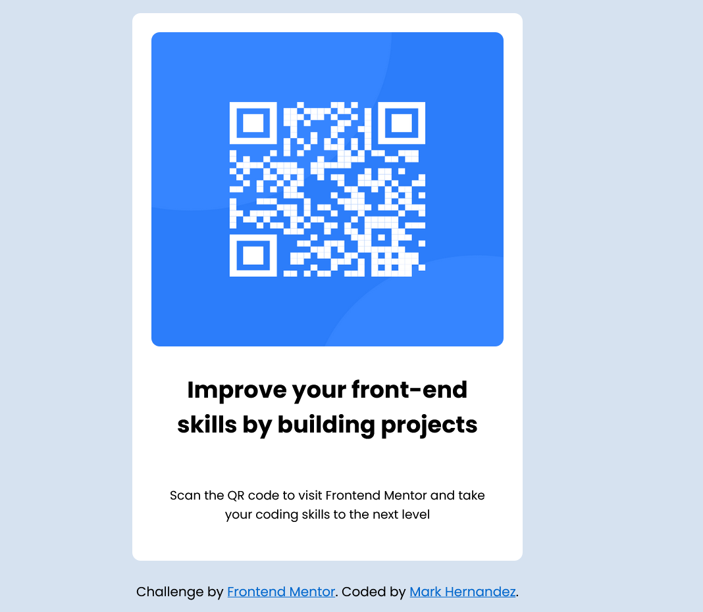

# Frontend Mentor - QR code component solution

This is a solution to the [QR code component challenge on Frontend Mentor](https://www.frontendmentor.io/challenges/qr-code-component-iux_sIO_H). Frontend Mentor challenges help you improve your coding skills by building realistic projects. 

## Table of contents

  - [Screenshot](#screenshot)
  - [Built with](#built-with)
  - [What I learned](#what-i-learned)
  - [Continued development](#continued-development)
  - [Author](#author)

### Screenshot




### Links

- Solution URL: [Add solution URL here](https://mkhernandez.github.io/qrcode)
- Live Site URL: [Add live site URL here](https://mkhernandez.github.io/qrcode)

### Built with

- Semantic HTML5 markup
- CSS custom properties
- Mobile-first workflow

### What I learned

I found that there can be multiple ways to accomplish the same result. I played around with some of the containerization of html elements and finally settled on a card like layout consisting of a div element with a container class and another div with a card class. From there I added another three divs into the card each with their own class: img, heading, and content.

```html
standard html
```
```css
.proud-of-this-css {
  display: flex;
  justify-content: center;
  align-items: center;
}
```
```js
no js in this challenge
```

### Continued development

I want to continue working on css as there are many ways of accomplishing the same output. It seems that the layout of the component can vary greatly and with that the styling applied will also vary. Therefore, it would be beneficial to learn multiple ways of making a website responsive since this can be done as such.

## Author
- Frontend Mentor - [@yourusername](https://www.frontendmentor.io/profile/mkhernandez)


